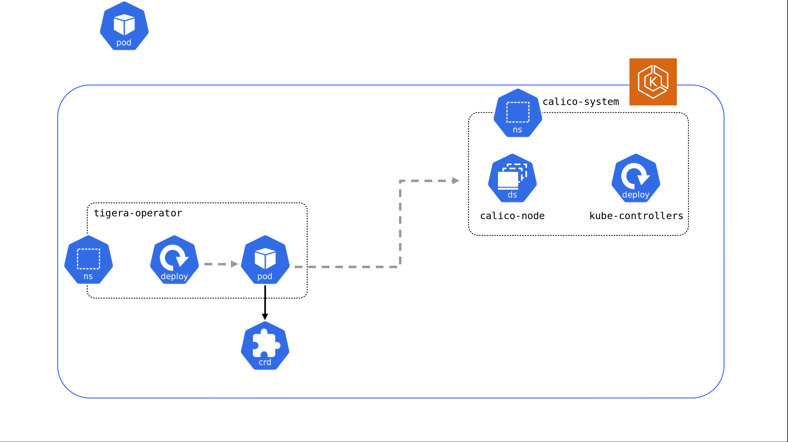

Deploying this Quick Start for a new virtual private cloud (VPC) with
*default parameters* builds the following _{partner-product-name}_ environment in the
AWS Cloud.

// Replace this example diagram with your own. Send us your source PowerPoint file. Be sure to follow our guidelines here : http://(we should include these points on our contributors giude)
[#architecture1]
.Quick Start architecture for {partner-product-short-name} on AWS

As shown in Figure 1, the Quick Start sets up the following in your Kubernetes cluster:

* The Tigera Operator and associated resources in its own namespace.
* A custom resource which configures the {partner-product-name} installation.
* {partner-product-name} resources in the `calico-system` namespace.
